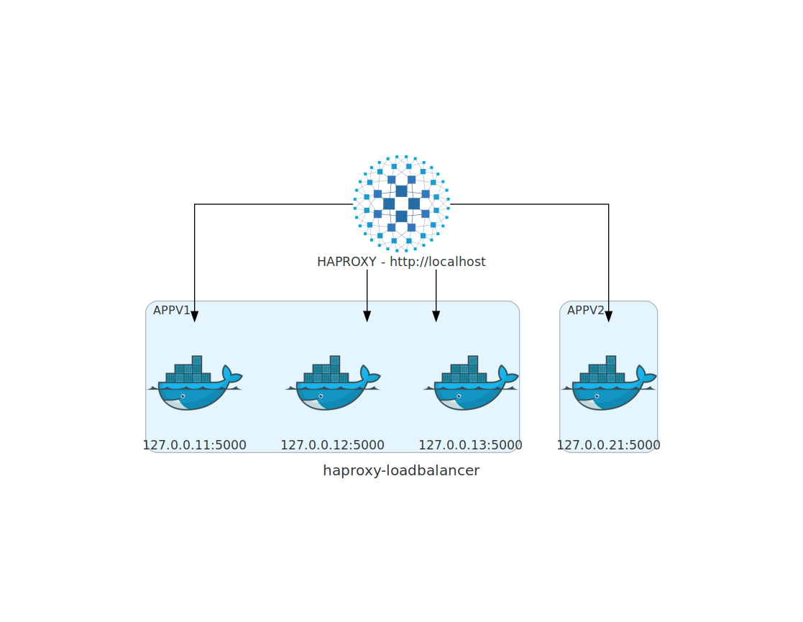

# HAPROXY como API Gateway - Alura mais

- Definir os 2 serviços docker e a instalação do HAPROXY no servidor
- Configurar os tipos de load-balance para roundrobin e weight
- Visualizar o load com instâncias rodando e não rodando

### Referências:

- Site oficial - [Link](http://www.haproxy.org/)

- Diagrama:



- Procedimento:

1. Criar uma VM para testes (Você pode usar sua própria máquina) com Linux.
2. Instalar o docker: 
```sh 
    sudo su -
    apt-get install curl
    curl -fsSL https://get.docker.com | sh
    docker ps -a
```
3. Subir 3 webservers na mesma porta com o docker:
```sh
    docker run -d -p 127.0.0.11:5000:80 --name node1 httpd
    docker run -d -p 127.0.0.12:5000:80 --name node2 httpd
    docker run -d -p 127.0.0.13:5000:80 --name node3 httpd
    docker ps
```

4. Instalar o haproxy:
```sh
    apt-get install haproxy -y
    vi /etc/haproxy/haproxy.cfg
```
5. Mudar o algoritimo para usar ACL

<pre>
#---------------------------------------------------------------------
# main frontend which proxys to the backends
#---------------------------------------------------------------------
frontend main
    bind *:80
    stats uri /haproxy?stats
    acl url_static       path_beg       -i /static /images /javascript /stylesheets
    acl url_static       path_end       -i .jpg .gif .png .css .js

    #use_backend static          if url_static
    default_backend             app

#---------------------------------------------------------------------
# static backend for serving up images, stylesheets and such
#---------------------------------------------------------------------
#backend static
#    balance     roundrobin
#    server      static 127.0.0.1:81 check

#---------------------------------------------------------------------
# round robin balancing between the various backends
#---------------------------------------------------------------------
backend app
    #balance     roundrobin
    server  app1 127.0.0.11:5000 check
    server  app2 127.0.0.12:5000 check
    server  app3 127.0.0.13:5000 check
</pre>

6. Criar a versao nova do servico em node js

```sh
    apt install npm
    npm init
    npm install express --save
    docker build -t appv2 .
    docker run -d -p 127.0.0.21:5000:5000 --name appv2 appv2
```

7. Alterando o HAPROXY para rotear a url /v2 para a nova app

```sh 
    vi /etc/haproxy/haproxy.cfg
``` 

<pre>
#---------------------------------------------------------------------
# main frontend which proxys to the backends
#---------------------------------------------------------------------
frontend main
    bind *:80
    stats uri /haproxy?stats
    acl url_static       path_beg       -i /static /images /javascript /stylesheets
    acl url_static       path_end       -i .jpg .gif .png .css .js

    #use_backend static          if url_static
    default_backend             app

    acl url_v2 path_beg /v2
    use_backend appV2 if url_v2

#---------------------------------------------------------------------
# static backend for serving up images, stylesheets and such
#---------------------------------------------------------------------
#backend static
#    balance     roundrobin
#    server      static 127.0.0.1:81 check

#---------------------------------------------------------------------
# round robin balancing between the various backends
#---------------------------------------------------------------------
backend app
    #balance     roundrobin
    server  app1 127.0.0.11:5000 check
    server  app2 127.0.0.12:5000 check
    server  app3 127.0.0.13:5000 check
backend appV2
    server  app4 127.0.0.21:5000 check
</pre>